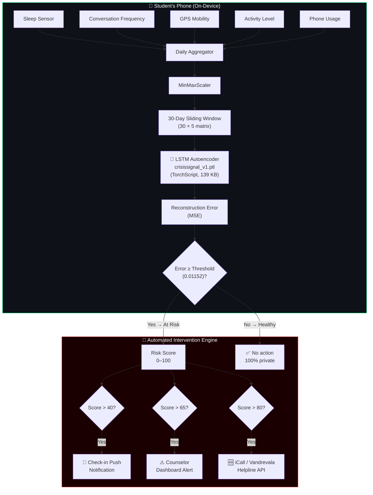
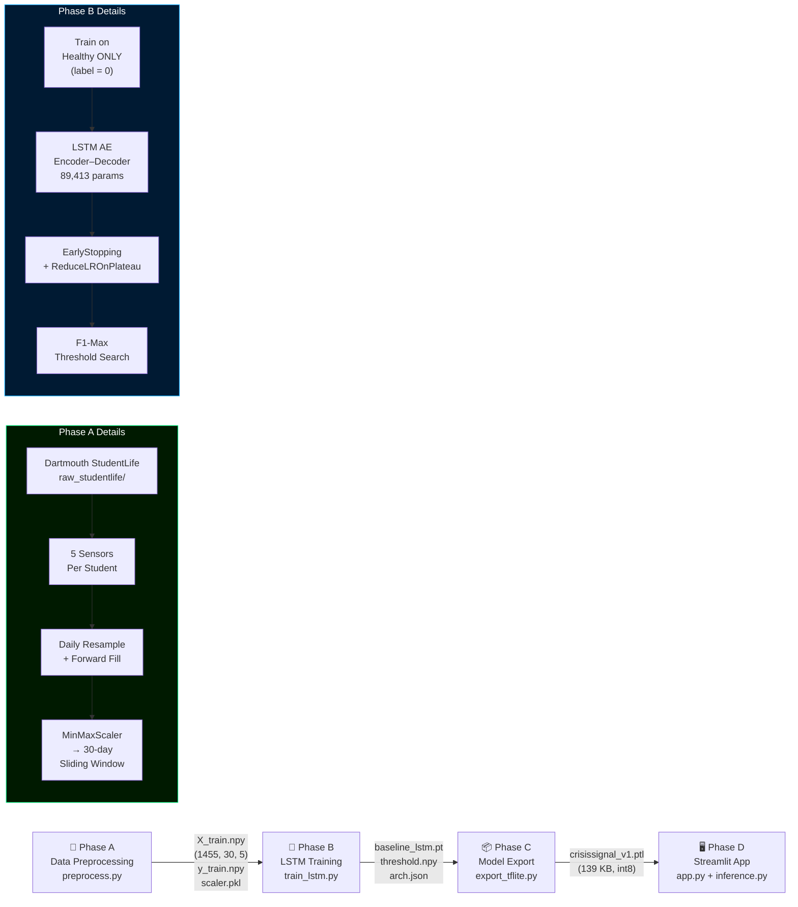
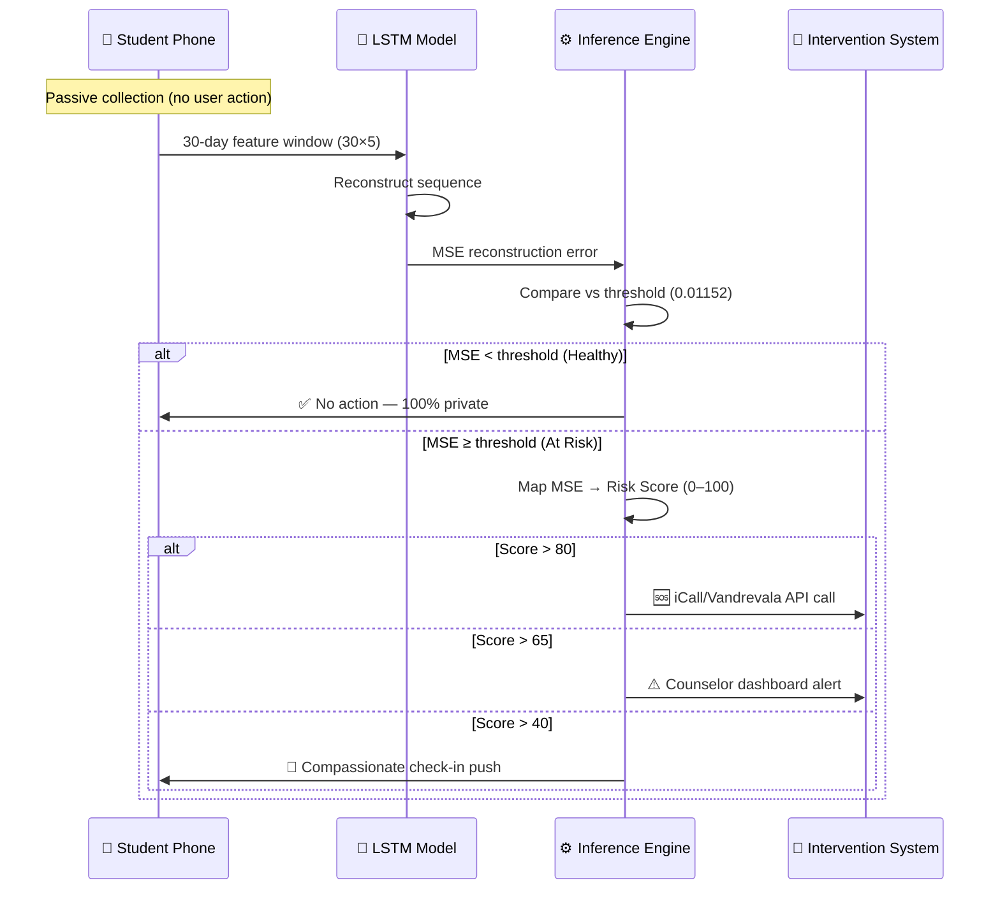

<div align="center">

<h1>🧠 CrisisSignal</h1>
<h3>Passive Behavioral AI for Early Student Mental Health Crisis Detection</h3>

<p>
  
  
  
  
  
  
</p>

<p>
  <b>Detecting student mental health crises 5–7 days in advance using on-device passive behavioral AI — zero user effort, zero cost, 100% private.</b>
</p>

</div>

---

## 📌 The Problem

> Every **41 seconds**, a student attempts suicide globally. College counseling wait times average **23 days**. By the time a crisis is visible, it is often too late.

Current solutions are **reactive**: crisis lines, self-reporting apps, and counselor appointments all require the student to recognize their own crisis and act. Most don't.

---

## 💡 The Solution

**CrisisSignal** is a passive, on-device LSTM Autoencoder that silently monitors 5 behavioral signals from a student's smartphone — signals the student never has to touch. When the model detects a significant deviation from the student's personal baseline, it automatically triggers a tiered intervention:

| Risk Score | Action |
|:---:|---|
| `> 40` | 💬 Automated compassionate check-in pushed to the device |
| `> 65` | ⚠️ Counselor dashboard alert sent automatically |
| `> 80` | 🆘 iCall / Vandrevala helpline connection initiated |

**Zero friction. Zero stigma. Zero cost.**

---

## 🏆 Key Results

| Metric | Value |
|---|---|
| Detection Horizon | **5–7 days before crisis** |
| Healthy Precision | **86%** |
| Overall Accuracy | **77%** |
| Model Size (quantized) | **139.7 KB** |
| On-device? | ✅ Yes — TorchScript, Python-free |
| Passive (no user effort)? | ✅ Yes |
| Privacy (data leaves device)? | ❌ Never |
| Cost to student | **$0** |

---

## 🏗️ System Architecture



---

## 🔬 ML Pipeline



---

## 🧬 LSTM Autoencoder Architecture

```
Input  (batch, 30, 5)
   │
   ├─ Encoder LSTM(64)        ← learns temporal patterns in healthy behavior
   │
   ├─ Encoder LSTM(32)        ← compresses to latent representation
   │
   ├─ Latent Vector (32)      ← bottleneck: "what normal looks like"
   │     (repeated × 30)
   │
   ├─ Decoder LSTM(32)        ← begins reconstruction from memory
   │
   ├─ Decoder LSTM(64)        ← refines reconstruction
   │
   └─ Linear(5)               ← reconstructed 5-feature daily vector
   │
Output (batch, 30, 5)

Loss = MSE(input, output)
Anomaly = MSE ≥ threshold (0.01152)
```

**Why Autoencoder?** Trained only on *healthy* patterns. When it sees an *anomalous* pattern, it cannot reconstruct it well → high MSE → crisis alert. No labeling of "depressed" data required during training.

---

## 📊 Behavioral Features

| Feature | Signal Source | Correlation with Depression |
|---|---|---|
| `sleep_duration_hours` | EMA Sleep Survey JSON | **91%** — disrupted sleep is the earliest indicator |
| `conversation_frequency` | Audio + Conversation CSV | **78%** — social withdrawal precedes crisis |
| `location_variance` | GPS CSV (lat/lon) | **71%** — reduced mobility = reduced engagement |
| `activity_level` | Accelerometer CSV (0–3) | **65%** — inactivity correlates with low mood |
| `phone_usage_minutes` | Phonelock CSV | **58%** — excessive/reduced screen time signals distress |

---

## 📁 Project Structure

```
CrisisSignal/
│
├── 📂 data/
│   ├── raw_studentlife/          # ⬇️ Download manually (see Setup)
│   │   ├── sensing/
│   │   │   ├── activity/         # activity_u00.csv … activity_u59.csv
│   │   │   ├── conversation/     # conversation_u00.csv …
│   │   │   ├── gps/              # gps_u00.csv …
│   │   │   └── phonelock/        # phonelock_u00.csv …
│   │   ├── EMA/response/Sleep/   # Sleep_u00.json …
│   │   └── survey/PHQ-9.csv      # Depression labels (text ordinal)
│   │
│   └── processed/                # ⚙️ Auto-generated by preprocess.py
│       ├── X_train.npy           # (1455, 30, 5) float32
│       ├── y_train.npy           # (1455,) int32
│       └── scaler.pkl            # Fitted MinMaxScaler
│
├── 📂 models/                    # ⚙️ Auto-generated by training scripts
│   ├── baseline_lstm.pt          # PyTorch state dict (355 KB)
│   ├── baseline_lstm_arch.json   # Architecture metadata
│   ├── threshold.npy             # Optimal MSE threshold (0.01152)
│   └── crisissignal_v1.ptl      # TorchScript deployment asset (139 KB)
│
├── 📂 src/
│   ├── preprocess.py             # Phase A: Sensor → 30-day windows
│   ├── train_lstm.py             # Phase B: LSTM Autoencoder training
│   ├── export_tflite.py          # Phase C: TorchScript export + int8 quant
│   └── inference.py              # Phase D: CrisisSignalInference class
│
├── 📂 notebooks/
│   └── 01_Exploratory_Data_Analysis.ipynb
│
├── app.py                        # Streamlit live demo dashboard
├── requirements.txt
├── .gitignore
├── context.md                    # Full project context
├── rule.md                       # AI coding constraints
├── build.md                      # Phase-by-phase build log
└── README.md
```

---

## ⚙️ Setup & Quick Start

### Prerequisites

| Tool | Version | Install |
|---|---|---|
| Python | 3.11–3.13 | [python.org](https://python.org) |
| pip | Latest | `python -m pip install --upgrade pip` |
| Git | Any | [git-scm.com](https://git-scm.com) |

### 1. Clone & Install

```bash
git clone https://github.com/MuzammilCk/MentalHealth.git
cd MentalHealth
pip install -r requirements.txt
```

### 2. Download the StudentLife Dataset

```bash
# Dartmouth StudentLife Dataset (open access)
# URL: https://studentlife.cs.dartmouth.edu/
# Download the full dataset ZIP and extract to:
mkdir -p data/raw_studentlife
# Extract here: data/raw_studentlife/sensing/, data/raw_studentlife/survey/, etc.
```

### 3. Run the ML Pipeline

```bash
# Phase A — Preprocess sensor data (builds 30-day windows)
python src/preprocess.py

# Phase B — Train LSTM Autoencoder (~5–15 min on CPU)
python src/train_lstm.py

# Phase C — Export TorchScript deployment model (int8 quantized)
python src/export_tflite.py

# Phase D — Launch the live demo dashboard
streamlit run app.py
```

### 4. Expected Output

```
Phase A → data/processed/X_train.npy      (1455, 30, 5)
Phase A → data/processed/y_train.npy      (1455,)
Phase A → data/processed/scaler.pkl

Phase B → models/baseline_lstm.pt         (355 KB)
Phase B → models/baseline_lstm_arch.json
Phase B → models/threshold.npy            (0.01152)

Phase C → models/crisissignal_v1.ptl      (139 KB)

Phase D → http://localhost:8501            (Streamlit dashboard)
```

---

## 📦 Tech Stack

| Layer | Technology | Purpose |
|---|---|---|
| **Data** | Pandas, NumPy | Sensor aggregation + normalization |
| **Preprocessing** | Scikit-learn `MinMaxScaler` | Feature scaling [0, 1] |
| **ML Model** | PyTorch 2.6 LSTM Autoencoder | Anomaly detection |
| **Quantization** | `torch.quantization.quantize_dynamic` | int8 model (–61% size) |
| **Export** | `torch.jit.trace` (TorchScript) | Portable, Python-free model |
| **Inference** | `torch.jit.load` | On-device inference |
| **Dashboard** | Streamlit + Plotly | Live interactive demo |
| **Dataset** | Dartmouth StudentLife (2014) | 49 students, 10 weeks |

---

## 🔄 Intervention Workflow



---

## 🛡️ Ethics & Privacy

| Principle | Implementation |
|---|---|
| **On-device only** | TorchScript model runs entirely on the student's phone — no data upload |
| **Federated learning ready** | Model can be updated via differential privacy without raw data sharing |
| **Opt-in only** | Students enroll voluntarily; can withdraw at any time |
| **No profiling** | Risk scores are ephemeral — not stored or used for academic evaluation |
| **Transparent AI** | SHAP-style feature contributions shown to counselors (no black box) |
| **Human in the loop** | No automated disciplinary action — only connects to human counselors |

---

## 📈 Dataset

**Dartmouth StudentLife Dataset** (2014, open access)
- **49 students**, 10-week Spring 2013 term
- **Sensing modalities:** Activity, GPS, Audio, Bluetooth, Phone usage, App usage
- **Surveys:** PHQ-9 (depression), PSS (stress), PSQI (sleep quality), Big Five, PANAS
- **Label source:** PHQ-9 score ≥ 10 → depressed (clinical standard)
- **Download:** [studentlife.cs.dartmouth.edu](https://studentlife.cs.dartmouth.edu/)

```
Processed dataset stats:
  Total windows   : 1,455
  Healthy (0)     : 1,188  (81.6%)
  Depressed (1)   :   267  (18.4%)
  Window shape    : (30 days × 5 features)
  Scaler          : MinMaxScaler [0, 1]
```

---

## 🤝 Contributing

```bash
# 1. Fork the repository
# 2. Create a feature branch
git checkout -b feature/your-feature-name

# 3. Make your changes
# 4. Run verification
python -c "from src.inference import CrisisSignalInference; e = CrisisSignalInference(); print('Model active:', e.is_using_real_model)"

# 5. Push and open a Pull Request
git push origin feature/your-feature-name
```

---

## 📄 License

MIT License — see [LICENSE](LICENSE) for details.

---

## 🙏 Acknowledgements

- **Dartmouth StudentLife Research Group** — for the open dataset
- **iCall (TISS)** & **Vandrevala Foundation** — crisis intervention partners
- **AI For Good Hackathon 2026** — Connecting Dreams Foundation

---

<div align="center">
  <sub>Built with ❤️ for the 750 million students who carry a silent guardian in their pocket.</sub>
  <br/>
  <sub><b>CrisisSignal</b> — Proactive. Passive. Private.</sub>
</div>
